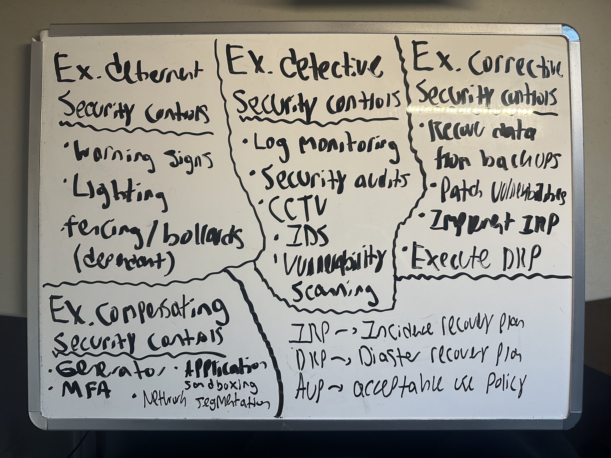
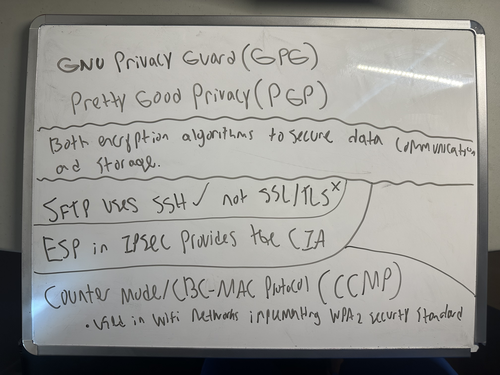
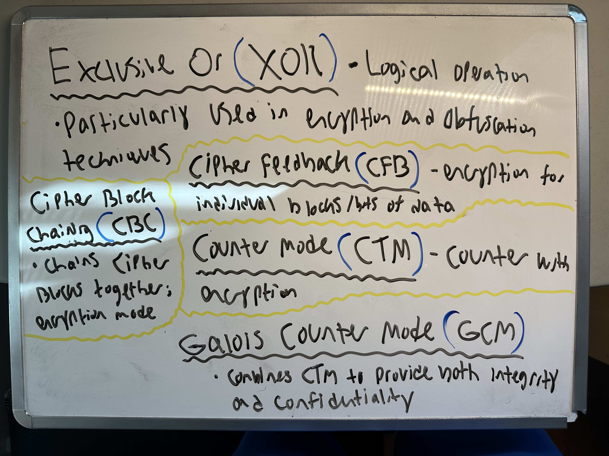
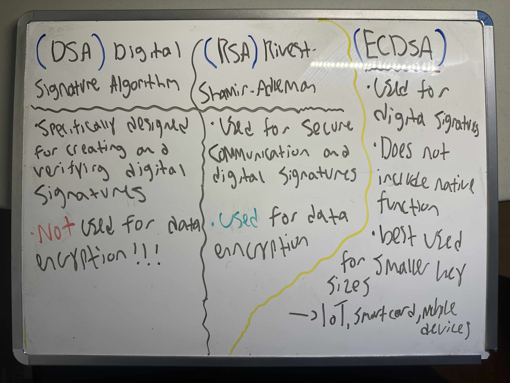
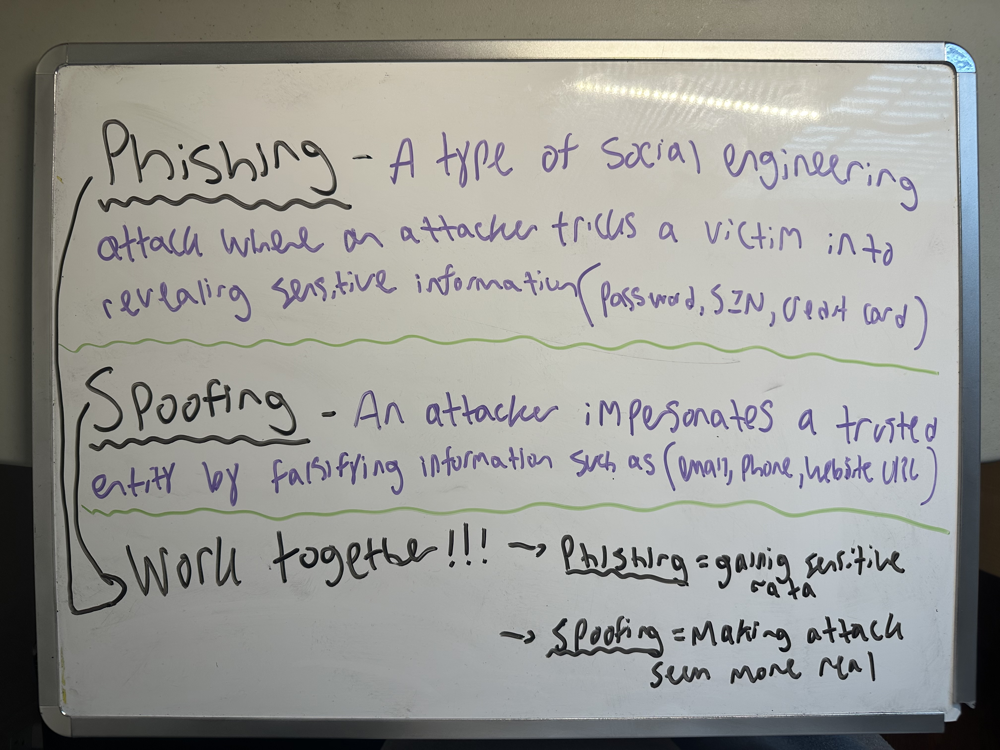
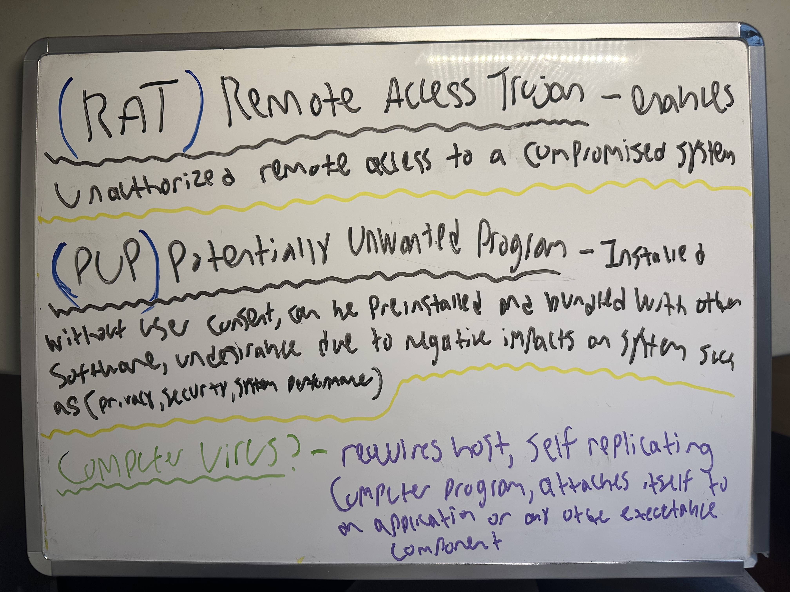
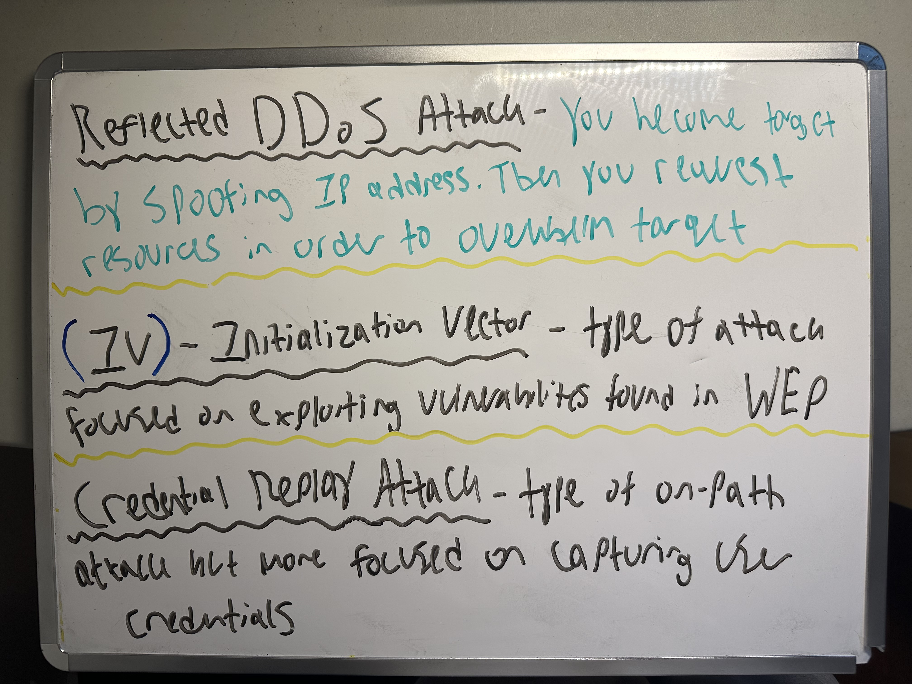
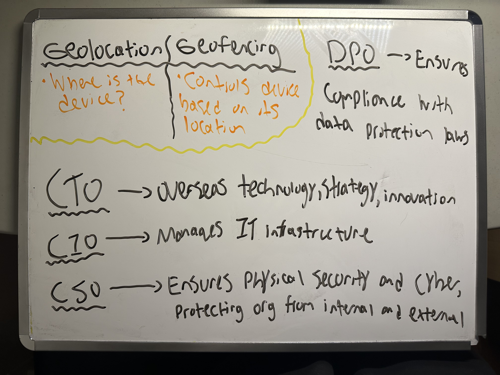
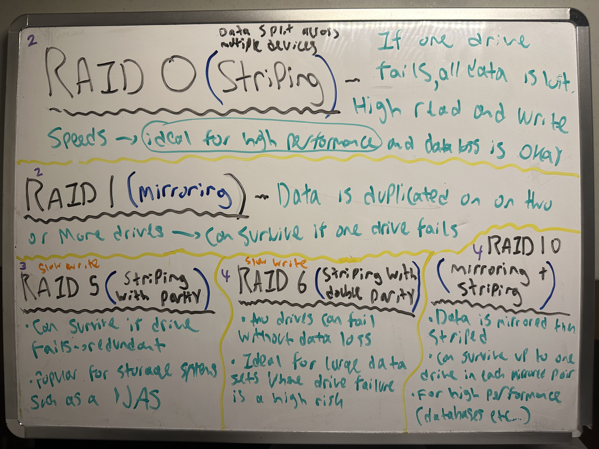
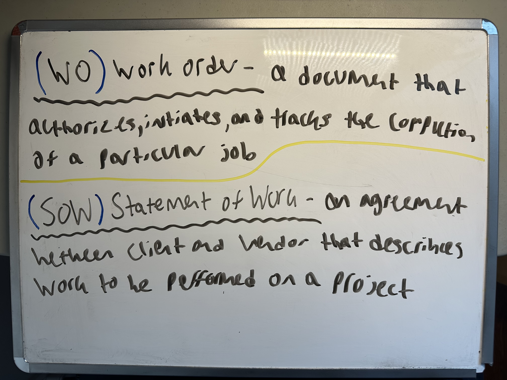

Security Controls Quiz → 11/15 : 73.33%

Encryption Quiz 1 → 20/36 : 55.55%

Encryption Quiz 2 → 36/36 : 100%

Hashing Quiz → 7/7 : 100%

Digital Signatures Quiz → 7/7 : 100%

Digital Certificates Quiz → 13/15 : 86%

Threat Vectors & Attack Surfaces Quiz → 17/17 : 100%

Social Engineering Quiz → 14/14 : 100%

Security Vulnerabilities Quiz → 15/20 : 75%

Malware Attacks Quiz → 8/11 : 72.73%

Network Attacks Quiz → 16/16 : 100%

Application Attacks Quiz → 9/9 : 100%

Indicators of Malicious Activity Quiz → 7/7 : 100%

Data Protection Concepts Quiz → 13/18 : 72%

Resilience and Recovery Quiz → 23/25 : 94.44%

Wireless Security Settings Quiz → 10/11 : 90.91%

Application Security Quiz → 9/13 : 69.23%

Vulnerability Management Quiz → 16/20 : 80%

Vulnerability Management Quiz → 8/8 : 100%

Access Controls Quiz → 9/9 : 100%

Password Concepts Quiz → 20/20 : 100%

Incident Response Activities Quiz → 10/10 : 100%

Risk Management Concepts Quiz → 28/28 : 100%

Agreement Types Quiz → 6/8 : 75%

Penetration Testing Quiz → 10/10 : 100%

 

#### Data Owner vs. Data Custodian vs. Data Controller vs. Data processor
